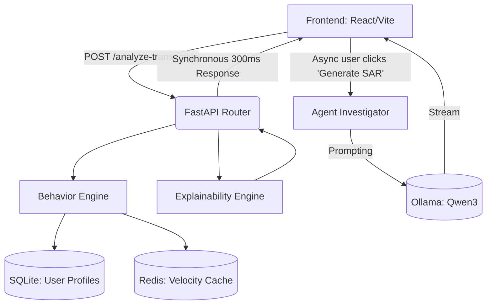

# 🧠 System Architecture & Design

SeedAI is designed around a scalable, microservices-inspired monolithic structure using Python/FastAPI for back-end high performance calculation, and an asynchronous task model for LLM offloading.

## High-Level Topology

---

## The Core Modules

### 1. `behavior_engine.py` (Math & Analytics)
The heart of the deterministic layer. It avoids massive historical database queries by using **Welford's Online Algorithm**, which computes running means and standard deviations in `O(1)` time limits.
*   It tracks `frequent_locations`, `active_hours`, `avg_amount`.
*   It uses **Redis** to strictly monitor 60-minute transaction velocity, completely neutralizing carding scripts.

### 2. `explainability_engine.py` (Transparency)
Modern fraud engines fail because compliance officers can't decode them. Our engine maps raw ML input into understandable business logic:
*   Instead of returning `score: 0.96`, it returns an array of deviations: `{ reason: "Amount Spiked", mathematical_deviation: "57.1x above baseline" }`.
*   This structured data powers the frontend Pipeline UI that users see in real-time.

### 3. `agent_investigator.py` (Agentic AI Workflow)
For instances where math isn't enough, we deploy Large Language Models.
Because LLMs are slow (sometimes 5-10 seconds for inference), they are physically decoupled from the `.analyze-transaction` route.
Instead, when an anomaly forces a `BLOCK`, an asynchronous Copilot is triggered. Evaluated against strict prompt templates, we use local models (like `qwen3:1.7b`) to synthesize Suspicious Activity Reports (SAR) automatically.

---

## Securing the API

All endpoints are built stateless. The only state maintained is within the User Behavior Profiles table and the transient Redis cache, ensuring the application can be safely load-balanced horizontally in a production AWS/GCP environment.
